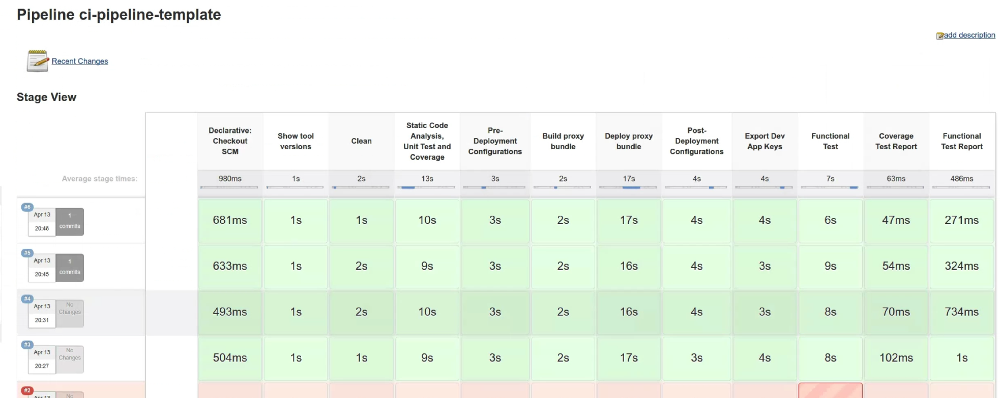

This is the README file !!!

To run the build locally

Install Maven and run the following command from the currency-v1 directory

`mvn clean install -Ptest -Dorg={org} -Dusername={username} -Dpassword={password} -Dapigee.config.dir=./target/resources/edge -Dapigee.config.options=update -Dapigee.config.exportDir=./target/test/integration/`

For example

`mvn clean install -Ptest -Dorg=testOrg -Dusername=test@example.com -Dpassword=iamasecret -Dapigee.config.dir=./target/resources/edge -Dapigee.config.options=update -Dapigee.config.exportDir=./target/test/integration/`

For more info - checkout the [usage](./usage.md) instructions

If you use Jenkins 2.0, you can use the pipeline plugin which will look like this

